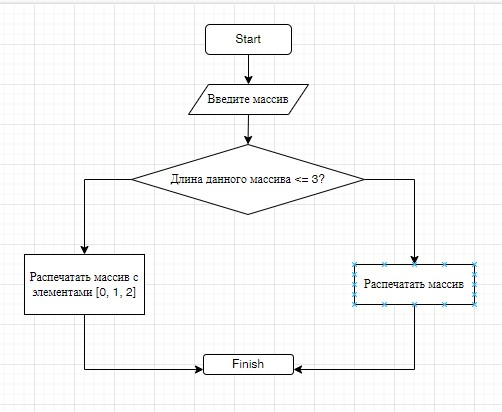

# **РЕШЕНИЕ ЗАДАЧИ**

## *Условие задачи*

Написать программу, которая из имеющегося массива строк формирует массив из строк, длина которых меньше либо равна 3 символа. Первоначальный массив можно ввести с клавиатуры, либо задать на старте выполнения алгоритма.

_____________________________________________________________________________

* Блок схема алкгоритма решения задачи:

* Алгоритм решения:

1. Запросить у пользователя ввод массива;
2. Написать функцию, которая будет проверять, какой длины массив, введённый пользователем;
3. Вывести первые три элемента массива.